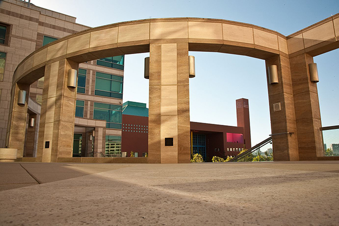

*Annual PBBR Postdoctoral Fellowship Call for Proposals has gone out! Applications are due Friday, May 29, 2015. For instructions, click here.

 Only those who dare fail greatly can ever achieve greatly.
 -Robert F. Kennedy

The Program for Breakthrough Biomedical Research (PBBR) seeks to stimulate and support highly innovative basic science research at UCSF. The focus is on basic science projects of potentially high impact that are creative, risky, and transformative. We seek novel ideas for basic science projects that are more ambitious than those that receive funding from NIH and other traditional funding mechanisms.

The Program for Breakthrough Biomedical Research is currently in its remarkable eighteenth year. Investigators credit the Program for Breakthrough Biomedical Research with engendering over $1.2 billion in subsequent grant funding, and projects and their derivatives have resulted in over 2,000 scientific publications and dozens of patents.

Scientist quotes about the Program for Breakthrough Biomedical Research:

The Program for Breakthrough Biomedical Research provides a model for how to empower scientists to take calculated risks and reach for the stars, enabling them to make the transformative discoveries that are the real engines of scientific advance. It is a much needed antidote to the current research funding mechanisms that reward conservative research and avoid risk-taking, and penalize young investigators. As a grateful recipient of one of the program's grants back in the late 90s, I applaud UCSF for preserving and expanding this important funding mechanism.

Marc Tessier-Lavigne, PhD
The Rockefeller University president and head of the Laboratory of Brain Development

A sustained and solid attack is needed for opening up new types of research. Support from the Program for Breakthrough Biomedical Research gives interdisciplinary work a critically important jump start, allowing new directions for collaborative groups not generally funded by federal research funds.

Elizabeth Blackburn, PhD
UCSF Professor of Biochemistry & Biophysics
Nobel Prize in Physiology or Medicine, 2009

 
	The Program for Breakthrough Biomedical Research is operated at the University of California San Francisco.