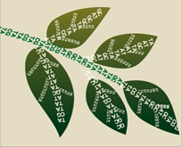

##Application Process

 

The application is brief, consisting of just a 2 page research description, the applicant’s Biosketch and Other Support, and a budget and budget justification. Funding usually begins within 3 months of submitting a proposal. To see the Winter 2015 Call for Proposals click here.
For more information on PBBR awards, contact Kerri Santos.

 